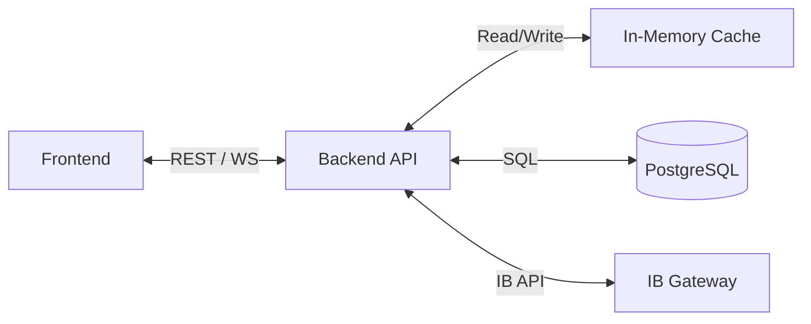
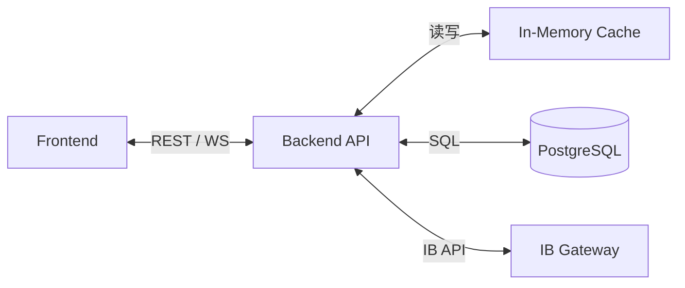

# Details

[English](#english) | [中文](#中文)

## English

### Architecture Diagram

### Backend API (Including WebSocket)

| Method | Path | Data Source | Response | Notes |
| --- | --- | --- | --- | --- |
| GET | `/health` | Local | `{ status, time }` | Basic health check |
| POST | `/sync/stop` | SyncManager | Status | Stop sync thread |
| GET | `/sync/status` | SyncManager | Gateway/IBKR status | Includes `ibkr_connected` |
| GET | `/sync/health` | SyncManager | Status + `vnc_url` | Used by frontend polling |
| POST | `/gateway/restart` | K8s or flag file | Restart result | Re-auth entry |
| POST | `/orders` | IB Gateway | Order result | Idempotency supported |
| GET | `/positions` | Cache first | Current positions | DB fallback |
| GET | `/positions/history` | Cache first | Historical positions | DB fallback |
| GET | `/pnl/summary` | Cache first | `{ realized, unrealized, daily, total }` | Account PnL |
| GET | `/pnl/daily` | Cache first | Daily PnL list | DB fallback |
| GET | `/account/summary` | Cache first | Account health metrics | DB fallback |
| GET | `/pnl/trade-cumulative` | Cache first | Cumulative Daily PnL | Trend chart |
| GET | `/trades` | DB | Trade list | For export/debug |
| GET | `/positions/{id}/trades` | DB | Trades for a position | Used by frontend |
| WS | `/ws/updates` | Cache first | Real-time snapshot | `summary/positions/history/daily_pnl/account_summary` |

**/ws/updates payload**
- `summary`: account PnL summary (total/daily/realized/unrealized).
- `positions`: current positions.
- `history`: historical positions.
- `daily_pnl`: daily PnL series.
- `account_summary`: account health metrics.

### Frontend Data Flow (Startup/Refresh)

1. Initial page load calls: `/pnl/summary`, `/positions`, `/positions/history`, `/account/summary`, `/pnl/trade-cumulative`.
2. WebSocket `/ws/updates` updates `summary / positions / history / account_summary`.
3. `/pnl/trade-cumulative` is refreshed every 15 seconds for the trend chart.
4. `/sync/health` is polled every 2 seconds for Gateway/IBKR status.
5. `/positions/{id}/trades` is fetched to show trade details and compute fee totals.
6. Order panel submits to `/orders` and shows queued/placed status.

### Panel Data Sources & Computation

1. Top PnL cards: `/pnl/summary` or WS `summary`.
2. Cumulative PnL (Trend): `/pnl/trade-cumulative` using `cumulative_pnl`.
3. Account Health: `/account/summary` or WS `account_summary`.
4. Current Positions: `/positions` or WS `positions`.
5. Historical Positions: `/positions/history` or WS `history`.
6. Fee total: frontend sums `commission` from `/positions/{id}/trades`.
7. `Value`: frontend calculates `qty * avg_cost`.
8. Unrealized/Total ratios: frontend uses `|qty * avg_cost|` as denominator.

### IB Gateway Events (Inbound)

| Event | Purpose | Backend Handling |
| --- | --- | --- |
| `execDetailsEvent` | Trade executions | Insert `trades`, update cache and `positions.realized_pnl` |
| `commissionReportEvent` | Commission/realized update | Update `trades` and cache realized |
| `positionEvent` | Position changes | Upsert `positions`, update cache, subscribe `PnLSingle` |
| `pnlSingleEvent` | Per-position PnL | Update cache `unrealized/daily`, batch flush |
| `pnlEvent` | Account PnL | Update daily PnL cache |
| `accountSummaryEvent` | Account summary | Update cache and write `account_summary` immediately |
| `errorEvent` | Connection status | 1100/1101/1102 update `ibkr_connected` |

### IB Gateway Requests (Outbound)

| Call | Purpose |
| --- | --- |
| `reqPositions` | Current positions snapshot |
| `reqExecutions` | Executions snapshot |
| `reqPnL` | Subscribe account PnL |
| `reqAccountSummary` | Subscribe account summary |
| `reqPnLSingle` | Subscribe per-position PnL |
| `cancelPnLSingle` | Cancel per-position PnL |
| `reqCurrentTime` | Keepalive |
| `qualifyContracts` | Contract qualification before order |
| `placeOrder` | Place order |

### Backend Startup Flow

1. `init_db()` creates tables.
2. Create `CacheStore` and `IBKRSyncManager`.
3. Load cache snapshot from DB (positions/history/account_summary/daily_pnl).
4. If `ib_auto_sync` is enabled, start sync thread.
5. Sync thread connects to IB Gateway, registers callbacks, and requests initial data.
6. Loop: `ib.sleep(1)`, `reqCurrentTime` keepalive, batch flush `pnlSingle`, process order queue.
7. On disconnect, update status and retry with backoff.

### Cache / Persistence Strategy

**Cache-first**
- REST and WS read from cache by default.
- DB is used only when cache is not initialized.

**Immediate persistence**
- `trades`: execution/commission updates.
- `positions`: position upsert; `realized_pnl` updates after trade/commission.
- `account_summary`: written immediately on event.
- `positions_history`: written when a position is closed.

**Batch / periodic persistence**
- `positions.unrealized_pnl` and `positions.daily_pnl`: buffered from `pnlSingleEvent`, flushed by `IBKR_CACHE_FLUSH_SECONDS`.
- `account_daily_pnl`: written once per day when trade date rolls over.

**Not persisted (frontend computed)**
- `Value`: `qty * avg_cost`.
- `FEE`: sum of commissions for the position.
- Unrealized/Total ratios: `pnl / |qty * avg_cost|`.

### Failure & Recovery Strategy

**Connection status**
- Gateway connection: backend-to-IB Gateway TCP status (`connected`).
- IBKR connection: derived from `errorEvent` 1100/1101/1102 (`ibkr_connected`).

**Reconnect**
- Sync thread retries with exponential backoff on disconnect.
- On reconnect, resubscribes positions/executions/pnl/account summary.

**Staleness**
- Cache serves last known snapshot if IBKR is disconnected.
- DB fallback only when cache is not initialized.

**Safety**
- Order queue is bounded; overflow returns an error.
- Idempotent order submission prevents duplicates.

## 中文

### 架构图

### 后端接口清单（含 WebSocket）

| 方法 | 路径 | 数据来源 | 返回内容概要 | 说明 |
| --- | --- | --- | --- | --- |
| GET | `/health` | 内部 | `{ status, time }` | 基础健康检查 |
| POST | `/sync/stop` | SyncManager | 运行状态 | 停止后台同步线程 |
| GET | `/sync/status` | SyncManager | Gateway/IBKR 状态 | 含 `ibkr_connected` |
| GET | `/sync/health` | SyncManager | 状态 + `vnc_url` | 前端轮询使用 |
| POST | `/gateway/restart` | K8s 或文件 | 重启结果 | Re-auth 入口 |
| POST | `/orders` | IB Gateway | 下单结果 | 支持幂等键 |
| GET | `/positions` | Cache 优先 | 当前持仓列表 | 缓存未就绪时读 DB |
| GET | `/positions/history` | Cache 优先 | 历史持仓列表 | 缓存未就绪时读 DB |
| GET | `/pnl/summary` | Cache 优先 | `{ realized, unrealized, daily, total }` | 账户汇总 |
| GET | `/pnl/daily` | Cache 优先 | 每日 PnL 列表 | 缓存未就绪时读 DB |
| GET | `/account/summary` | Cache 优先 | 账户健康度指标 | 缓存未就绪时读 DB |
| GET | `/pnl/trade-cumulative` | Cache 优先 | Daily PnL 累加序列 | 供趋势图 |
| GET | `/trades` | DB | 成交列表 | 后台导出用 |
| GET | `/positions/{id}/trades` | DB | 指定持仓成交明细 | 前端展开用 |
| WS | `/ws/updates` | Cache 优先 | 实时快照 | `summary/positions/history/daily_pnl/account_summary` |

**/ws/updates payload**
- `summary`: 账户 PnL 汇总（total/daily/realized/unrealized）。
- `positions`: 当前持仓列表（含每日/未实现/已实现）。
- `history`: 历史持仓列表（含开平仓时间、已实现）。
- `daily_pnl`: 每日 PnL 时间序列。
- `account_summary`: 账户健康度指标。

### 前端启动/刷新与数据来源

1. 页面加载时并发调用：`/pnl/summary`、`/positions`、`/positions/history`、`/account/summary`、`/pnl/trade-cumulative`。
2. 建立 WebSocket `/ws/updates`，收到消息后更新 `summary / positions / history / account_summary`。
3. `pnl/trade-cumulative` 每 15 秒轮询刷新趋势图。
4. `/sync/health` 每 2 秒轮询，展示 Gateway 与 IBKR 的连接状态。
5. `positions/{id}/trades` 在持仓列表更新或展开时请求，用于手续费汇总与成交明细。
6. 订单面板通过 `/orders` 下单，返回排队/已下单状态。

### 各面板数据如何获取/计算

1. 顶部 PnL 卡片：来自 `/pnl/summary` 或 WS 的 `summary`。
2. Cumulative PnL (Trend)：来自 `/pnl/trade-cumulative`，使用 `cumulative_pnl`。
3. Account Health：来自 `/account/summary` 或 WS 的 `account_summary`。
4. Current Positions：来自 `/positions` 或 WS 的 `positions`。
5. 历史持仓：来自 `/positions/history` 或 WS 的 `history`。
6. 手续费合计：前端对 `/positions/{id}/trades` 的 `commission` 求和。
7. `Value`：`qty * avg_cost` 前端计算。
8. Unrealized/Total 比例：前端计算 `value` 为分母。

### 后端监听 IB Gateway 的事件与处理

| 事件 | 功能 | 后端处理 |
| --- | --- | --- |
| `execDetailsEvent` | 成交回报 | 写入 `trades`，更新缓存与 `positions.realized_pnl` |
| `commissionReportEvent` | 手续费/已实现回报 | 更新 `trades` 与缓存 realized |
| `positionEvent` | 持仓变更 | Upsert `positions`，更新缓存与订阅 `PnLSingle` |
| `pnlSingleEvent` | 单持仓 PnL | 更新缓存 `unrealized/daily`，加入批量落库队列 |
| `pnlEvent` | 账户 PnL | 更新当日 PnL 缓存 |
| `accountSummaryEvent` | 账户汇总 | 更新缓存并即时落库 `account_summary` |
| `errorEvent` | 连接状态 | 1100/1101/1102 更新 `ibkr_connected` |

### 后端调用 IB Gateway 的主动请求

| 调用 | 功能 |
| --- | --- |
| `reqPositions` | 拉取当前持仓快照 |
| `reqExecutions` | 拉取成交快照 |
| `reqPnL` | 订阅账户 PnL |
| `reqAccountSummary` | 订阅账户健康度指标 |
| `reqPnLSingle` | 订阅单持仓 PnL |
| `cancelPnLSingle` | 取消单持仓 PnL |
| `reqCurrentTime` | Keepalive |
| `qualifyContracts` | 下单前合约校验 |
| `placeOrder` | 下单 |

### 后端启动流程

1. `startup` 时执行 `init_db()`，创建表结构。
2. 初始化 `CacheStore` 与 `IBKRSyncManager`。
3. 从数据库加载缓存快照（positions/history/account_summary/daily_pnl）。
4. 如果 `ib_auto_sync` 开启，启动同步线程。
5. 同步线程连接 IB Gateway，注册事件回调，发起初始请求（positions/executions/pnl/account summary）。
6. 进入循环：`ib.sleep(1)`、定时 `reqCurrentTime` 保活、批量落库 `pnlSingle`、处理订单队列。
7. 断连时更新状态并退避重连。

### 缓存/落库策略

**缓存优先**
- API 与 WebSocket 默认读取内存缓存。
- 缓存未就绪时才回退读取数据库。

**即时落库**
- `trades`：成交与手续费回报实时写入。
- `positions`：持仓变化实时 upsert；`realized_pnl` 在成交/手续费回报后实时更新。
- `account_summary`：账户汇总事件到来即写库。
- `positions_history`：持仓归档时写库。

**批量/周期落库**
- `positions` 的 `unrealized_pnl` / `daily_pnl` 由 `pnlSingleEvent` 更新缓存后，按 `IBKR_CACHE_FLUSH_SECONDS` 批量写入。
- `account_daily_pnl`：当检测到跨交易日时，将上一交易日的 daily pnl 落库（一次性写入）。

**不落库字段（前端计算）**
- `Value`：`qty * avg_cost`
- `FEE`：持仓成交手续费合计
- Unrealized/Total 比例：前端以 `|qty * avg_cost|` 为分母计算

### 故障与恢复策略

**连接状态识别**
- Gateway 连接：后端与 IB Gateway 的 TCP 连接状态（`connected`）。
- IBKR 连接：通过 `errorEvent` 1100/1101/1102 标记 `ibkr_connected`。

**断连恢复**
- 断连后同步线程进入退避重连。
- 恢复连接后重新订阅 positions/executions/pnl/account summary。

**数据陈旧性处理**
- 实时数据优先使用缓存；若缓存未初始化则回退 DB。
- 若出现 IBKR 断连，缓存将停止更新，但仍可提供最近快照。

**异常与兜底**
- 订单队列有长度限制，超限返回错误。
- 幂等下单防止重复提交。
